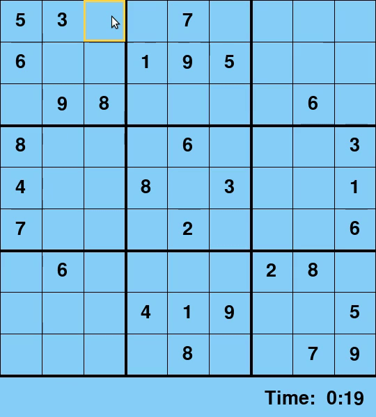

# Sudoku Solver
Sudoku solver using recursive backtracking.

# Instructions
- Select a box and enter a number. To confirm value press Enter. A red X or green O will appear depending if your guess is correct. 
- Press Space to have the algorithm solve the board.

# Demo

